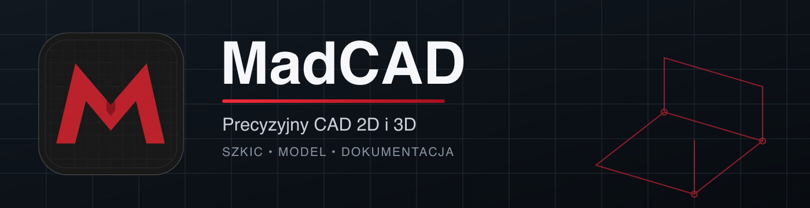

# MadCAD 6.3



[](https://github.com/kamil5646/MadCAD2D/releases/latest)
[](https://github.com/kamil5646/MadCAD2D/actions/workflows/ci.yml)


[](https://paypal.me/refek1)

MadCAD to desktopowy CAD 2D/3D dla Windows, macOS i Linux. Jego rdzeniem jest szybkie
szkicowanie w stylu klasycznego CAD połączone z parametryczną historią oraz
modelowaniem bryłowym. Przygotowanie plików do druku 3D jest opcjonalnym dodatkiem.

**[Pobierz najnowsze stabilne wydanie](https://github.com/kamil5646/MadCAD2D/releases/latest)** ·
**[Strona projektu](https://kamil5646.github.io/MadCAD2D/)** ·
**[Licencja](./LICENSE)** ·
**[Zmiany](./madcad-2d/CHANGELOG.md)**

> **Uwaga o wydaniu 6.3.0:** paczki są publikowane bez podpisu producenta,
> dlatego Windows SmartScreen lub macOS Gatekeeper mogą wyświetlić ostrzeżenie.
> Pobieraj je wyłącznie z oficjalnego GitHub Release i sprawdź sumę SHA-256.
> Wbudowany aktualizator pobiera paczkę z oficjalnego wydania, sprawdza SHA-256
> i otwiera ją; potwierdzenie instalacji pozostaje po stronie systemu.

## Najważniejsze możliwości

- Rysowanie bezpośrednio na płótnie oraz dokładne wejście z klawiatury.
- Linia w stylu AutoCAD: kliknij początek, ustaw kierunek kursorem, wpisz długość i naciśnij `Enter`.
- Podpowiedzi po najechaniu z opisem działania; skróty podstawowych funkcji są pokazywane tylko w podpowiedzi.
- Podstawowe skróty zgodne z Autodesk Fusion: `L`, `R`, `C`, `T`, `O`, `P`, `M`, `I`, `E` i `Del`.
- Szkice parametryczne z więzami, wymiarami, profilami i szykami. Importuj DWG lokalnie przez GNU LibreDWG lub ODA, a także SVG i DXF.
- Modelowanie 3D: Extrude, Revolve, Sweep, Loft, Coil, Boolean, Shell, Draft, fillet i chamfer.
- Trwałe referencje B-Rep, historia operacji, geometria konstrukcyjna i pomiary.
- Import i eksport `STEP`, `STL`, `3MF`; import szkicu `DWG`, `DXF`, `SVG`; własny parametryczny format `.madcad`.
- Kontrola drukowalności, gabarytów i dopasowania modelu do stołu drukarki.
- Interfejs polski i angielski, lokalne pliki, brak konta, telemetrii i aktywacji.
- Przeglądarka projektu jest domyślnie zwinięta, aby maksymalizować obszar rysowania.

## Szybki start

1. Pobierz paczkę dla swojego systemu z [Releases](https://github.com/kamil5646/MadCAD2D/releases/latest).
2. Uruchom instalator Windows, rozpakuj aplikację macOS albo nadaj pobranemu AppImage prawo uruchomienia na Linux.
3. Wybierz **Utwórz szkic**, wskaż płaszczyznę i zacznij rysować.
4. Najedź na funkcję, aby zobaczyć opis; skrót podstawowego narzędzia pojawi się w podpowiedzi, a nie na przycisku.

### Linia z dokładną długością

1. Naciśnij `L` albo kliknij **Linia**.
2. Kliknij punkt początkowy.
3. Ustaw kierunek kursorem.
4. Wpisz długość, np. `125.5`, i naciśnij `Enter`.

## Licencja

MadCAD korzysta z [MadCAD Personal and Commercial License 3.0](./LICENSE):

- **prywatnie:** bezpłatnie bez limitu czasu dla osoby fizycznej, do celów prywatnych, edukacyjnych i niezarobkowych;
- **ocena w firmie:** pełna wersja przez 40 dni bez opłaty;
- **komercyjnie:** po ocenie wymagana jest płatna, bezterminowa licencja dla każdego stanowiska;
- **bez aktywacji:** dowodem licencji komercyjnej jest dokument zakupu, nie klucz programu;
- **własność projektów:** pliki i rezultaty utworzone przez użytkownika pozostają jego własnością.

Wycena licencji komercyjnej: [kkasprzak15@icloud.com](mailto:kkasprzak15@icloud.com?subject=MadCAD%20-%20licencja%20komercyjna).
Darowizna przez [PayPal](https://paypal.me/refek1) wspiera rozwój, ale nie zastępuje licencji komercyjnej.

## Rozwój

Wymagany jest Node.js 22 i npm.

```bash
cd madcad-2d
npm ci
npm run dev
```

Najważniejsze kontrole:

```bash
npm run lint
npm test
npm run test:core
npm run test:core:coverage
npm run verify:repository
npm run verify:modeling
npm run verify:electron-security
```

Budowanie paczek:

```bash
npm run dist:mac:trusted
npm run dist:win:trusted
npm run dist:linux:trusted
```

## Struktura repozytorium

- [`madcad-2d/`](./madcad-2d/) — aplikacja Electron, interfejs i silnik CAD.
- [`docs/`](./docs/) — strona projektu publikowana przez GitHub Pages.
- [`.github/workflows/`](./.github/workflows/) — testy macOS/Windows/Linux i zweryfikowane wydania.
- [`LICENSE`](./LICENSE), [`EULA.md`](./EULA.md), [`PRIVACY.md`](./PRIVACY.md) — dokumenty prawne.

## English

MadCAD is a desktop 2D/3D CAD application for Windows, macOS, and Linux. It combines
classic CAD-style direct drawing and basic keyboard shortcuts with parametric solid
modeling and exact STEP exchange. STL/3MF export and 3D-print checks are optional
add-ons, not the center of the product.

Private, educational, non-profit use by an individual is free without a time
limit. Businesses may evaluate the complete application for 40 days. Continued
professional or commercial use requires a perpetual license for each
workstation. No product key or technical activation is required. See the
binding Polish [license](./LICENSE) or request a quote at
[kkasprzak15@icloud.com](mailto:kkasprzak15@icloud.com?subject=MadCAD%20commercial%20license).
